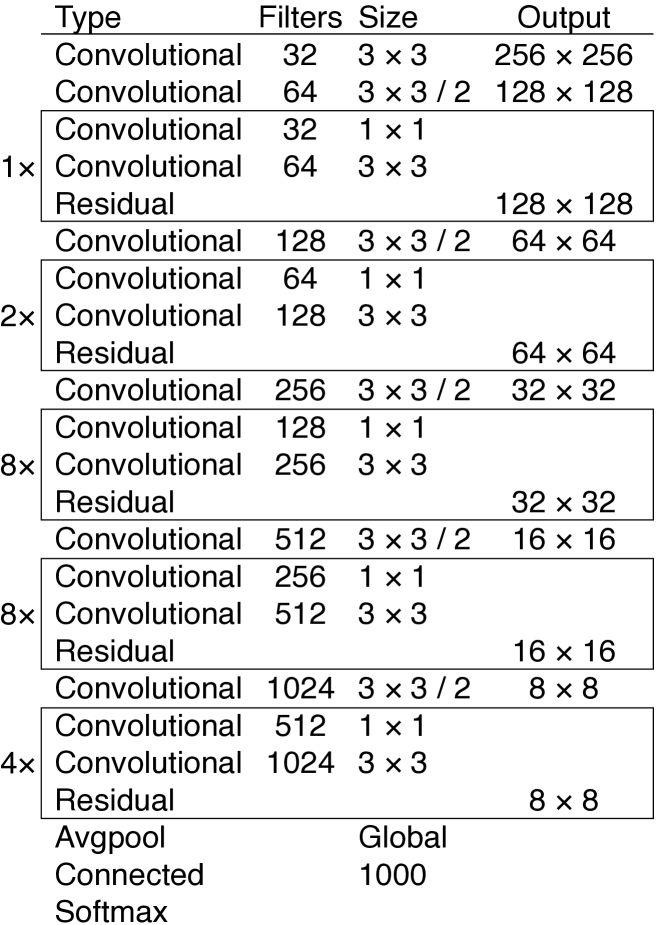

# learning notes
## datasets
这次是用COCO数据集，读取和之前不同，它分为图片和标注两个部分。
在本次任务中，我们在训练和验证时使用 **annotations_trainval2017** 这个文件下的instance标注，使用COCO API读取，
安装命令
```bash
conda install -c conda-forge pycocotools
```
测试集读取 **image_info_test2017** ，它不包含任何标注，仅提供测试集中图片基本信息，如编号，名称，长，宽，但是我们仍可以利用fiftyone可视化。

### 利用COCO API使用数据集
```python
from torchvision.datasets import CocoDetection
dataset = CocoDetection(
    root="images/train2017",
    annFile="annotations/instances_train2017.json",
    transforms=my_transforms
)
```
通过CocoDetection处理得到的数据集是Dataset的子类，我们可以直接使用。然后每个对象的格式是(PIL.Image, List[dict])，其中每个 dict 包含 bbox、category_id、segmentation 等，bbox的格式是一个列表包含一个点的横纵坐标和框的长宽，category_id给一个类别值，segmentation给分割的多边形的所有点，横纵坐标依次在一个一维列表中。
transforms会处理标注和图片，所以一般这么做。注意 **裁切时要同步变换标注** ，之后要学习collate_fn，padding等参数的使用。
```python
import torchvision.transforms as T

def train_transform(image, target):
    # 1) 随机缩放与裁剪
    # 2) 将 PIL 转为 Tensor
    image = T.ToTensor()(image)
    # 3) 归一化
    image = T.Normalize(mean, std)(image)
    # 4) 根据缩放裁剪更新 target["bbox"]
    return image, target

dataset = CocoDetection(root, annFile, transforms=train_transform)
```
如果不是实现自定义类应该不需要使用pycocotools.COCO，下面是一个两个例子。
```bash
from pycocotools.coco import COCO

# 初始化真实注释 COCO 对象
cocoGt = COCO("annotations/instances_train2017.json")

# 获取所有 person 类别的图像 IDs
person_cat = cocoGt.getCatIds(catNms=["person"])
img_ids    = cocoGt.getImgIds(catIds=person_cat)

# 加载前 5 张图像的元数据与注释
imgs = cocoGt.loadImgs(img_ids[:5])
for img in imgs:
    anns = cocoGt.loadAnns(cocoGt.getAnnIds(imgIds=[img["id"]], catIds=person_cat))
    masks = [cocoGt.annToMask(ann) for ann in anns]  # 二值掩码列表
```

```python
from pycocotools.coco import COCO
import os
from PIL import Image
import matplotlib.pyplot as plt

# 1. 指定 COCO Detection 标注文件
ann_file = "coco/annotations/instances_train2017.json"
coco     = COCO(ann_file)

# 2. 列出所有类别名称
cats = coco.loadCats(coco.getCatIds())
print("COCO Categories:", [c["name"] for c in cats])

# 3. 获取包含类别 'person' 的图像 IDs，并加载前 3 张图像
person_id = coco.getCatIds(catNms=["person"])[0]
img_ids   = coco.getImgIds(catIds=[person_id])[:3]
imgs      = coco.loadImgs(img_ids)

for img_info in imgs:
    # 4. 加载并显示图像
    img_path = os.path.join("coco/images/train2017", img_info["file_name"])
    img      = Image.open(img_path)
    plt.imshow(img); plt.axis("off")
    
    # 5. 获取并可视化该图像的所有检测框
    ann_ids = coco.getAnnIds(imgIds=[img_info["id"]], catIds=[person_id])
    anns    = coco.loadAnns(ann_ids)
    coco.showAnns(anns)  # 在当前图像上绘制边界框
    plt.show()
```
COCO API提供了处理我们得到的结果和标注的处理方式，以及结果的评估。
```python
from pycocotools.cocoeval import COCOeval
cocoGt = coco                          # 真实注释
cocoDt = cocoGt.loadRes("preds.json")  # 预测结果
eval  = COCOeval(cocoGt, cocoDt, iouType="bbox")
eval.evaluate(); eval.accumulate(); eval.summarize()
```
evaluate()会在不同阈值下计算给出框是否为真，按照置信度排列，存入self.evalImgs。
accumulate()评估结果整理到Precision-Recall 曲线和 Recall 曲线，存入self.eval['precision'] 与 self.eval['recall']
summarize()，给出各个AP，AR指标。

由于标注中不同图片的标注数量不同，所以标注不能拼接，所以我们要修改DataLoader的collate。具体而言collate_fn 接收 batch，其类型为 List[ Tuple[image, target] ]（长度为 batch_size），然后我们将图片编成一个张量，然后标注维持为列表，但都转化为元组。
```python
def detection_collate_fn(batch):
    # batch: list of (image_tensor, target_dict)
    return tuple(zip(*batch))
```
与其训练时在整合成一个张量，可以在这里整合。
```python
def detection_collate_fn(batch):
    images, targets = zip(*batch)
    images = torch.stack(images, dim=0)
    return images, targets
```
利用Albumentations实现对图片的裁切缩放，它会自动改相应的标注，它基于Numpy，在CPU上使用。
### fiftyone
### subset
利用COCO API随机抽取图片ID，然后选出相应图片，标注和类别信息，组成新的标注文件，然后和正常数据一样给CocoDetection，它可以根据标注自动从数据集中选出图片作为子集。

## 模型
根据论文，网络获取 320 &times; 320 的输入，
使用逻辑分类器而不是SoftMax，即不是一步步用MLP对应到各个类别，而是直接从之前的输出压缩到类别数。
从三个尺度预测，最后一个卷积层预测一个三维张量，包含边界框，对象性，类别，具体而言是N*N*(3*(4+1+80)),N*N是代表图片划分的N*N个区域，后面是三个边界框，每个包括四个边界框的定位信息，一个置信度，80个类别。
前两层提取特征上采样2倍，同时提取较早的特征级联合并，处理，预测。
从前面所有的计算中预测最终的边界框。
这是边界框先验：(10×13),(16×30),(33×23),(30×61),(62×45),(59×119),(116×90),(156×198),(373×326)
这是网络Darknet-53

这里提到的256 &times; 256 是用于分类工作。

后续检测头需要再darknet的yolov3.cfg文件中看到，经过处理的结构是这样的，原始文件和处理代码在model中。
```ini
Layer 76: convolutional with params {'batch_normalize': '1', 'filters': '512', 'size': '1', 'stride': '1', 'pad': '1', 'activation': 'leaky'}
Layer 77: convolutional with params {'batch_normalize': '1', 'size': '3', 'stride': '1', 'pad': '1', 'filters': '1024', 'activation': 'leaky'}
Layer 78: convolutional with params {'batch_normalize': '1', 'filters': '512', 'size': '1', 'stride': '1', 'pad': '1', 'activation': 'leaky'}
Layer 79: convolutional with params {'batch_normalize': '1', 'size': '3', 'stride': '1', 'pad': '1', 'filters': '1024', 'activation': 'leaky'}
Layer 80: convolutional with params {'batch_normalize': '1', 'filters': '512', 'size': '1', 'stride': '1', 'pad': '1', 'activation': 'leaky'}
Layer 81: convolutional with params {'batch_normalize': '1', 'size': '3', 'stride': '1', 'pad': '1', 'filters': '1024', 'activation': 'leaky'}
Layer 82: convolutional with params {'size': '1', 'stride': '1', 'pad': '1', 'filters': '255', 'activation': 'linear'}
Layer 83: yolo with params {'mask': '6,7,8', 'anchors': '10,13,  16,30,  33,23,  30,61,  62,45,  59,119,  116,90,  156,198,  373,326', 'classes': '80', 'num': '9', 'jitter': '.3', 'ignore_thresh': '.7', 'truth_thresh': '1', 'random': '1'}
Layer 84: route with params {'layers': '-4'}
Layer 85: convolutional with params {'batch_normalize': '1', 'filters': '256', 'size': '1', 'stride': '1', 'pad': '1', 'activation': 'leaky'}
Layer 86: upsample with params {'stride': '2'}
Layer 87: route with params {'layers': '-1, 61'}
Layer 88: convolutional with params {'batch_normalize': '1', 'filters': '256', 'size': '1', 'stride': '1', 'pad': '1', 'activation': 'leaky'}
Layer 89: convolutional with params {'batch_normalize': '1', 'size': '3', 'stride': '1', 'pad': '1', 'filters': '512', 'activation': 'leaky'}
Layer 90: convolutional with params {'batch_normalize': '1', 'filters': '256', 'size': '1', 'stride': '1', 'pad': '1', 'activation': 'leaky'}
Layer 91: convolutional with params {'batch_normalize': '1', 'size': '3', 'stride': '1', 'pad': '1', 'filters': '512', 'activation': 'leaky'}
Layer 92: convolutional with params {'batch_normalize': '1', 'filters': '256', 'size': '1', 'stride': '1', 'pad': '1', 'activation': 'leaky'}
Layer 93: convolutional with params {'batch_normalize': '1', 'size': '3', 'stride': '1', 'pad': '1', 'filters': '512', 'activation': 'leaky'}
Layer 94: convolutional with params {'size': '1', 'stride': '1', 'pad': '1', 'filters': '255', 'activation': 'linear'}
Layer 95: yolo with params {'mask': '3,4,5', 'anchors': '10,13,  16,30,  33,23,  30,61,  62,45,  59,119,  116,90,  156,198,  373,326', 'classes': '80', 'num': '9', 'jitter': '.3', 'ignore_thresh': '.7', 'truth_thresh': '1', 'random': '1'}
Layer 96: route with params {'layers': '-4'}
Layer 97: convolutional with params {'batch_normalize': '1', 'filters': '128', 'size': '1', 'stride': '1', 'pad': '1', 'activation': 'leaky'}
Layer 98: upsample with params {'stride': '2'}
Layer 99: route with params {'layers': '-1, 36'}
Layer 100: convolutional with params {'batch_normalize': '1', 'filters': '128', 'size': '1', 'stride': '1', 'pad': '1', 'activation': 'leaky'}
Layer 101: convolutional with params {'batch_normalize': '1', 'size': '3', 'stride': '1', 'pad': '1', 'filters': '256', 'activation': 'leaky'}
Layer 102: convolutional with params {'batch_normalize': '1', 'filters': '128', 'size': '1', 'stride': '1', 'pad': '1', 'activation': 'leaky'}
Layer 103: convolutional with params {'batch_normalize': '1', 'size': '3', 'stride': '1', 'pad': '1', 'filters': '256', 'activation': 'leaky'}
Layer 104: convolutional with params {'batch_normalize': '1', 'filters': '128', 'size': '1', 'stride': '1', 'pad': '1', 'activation': 'leaky'}
Layer 105: convolutional with params {'batch_normalize': '1', 'size': '3', 'stride': '1', 'pad': '1', 'filters': '256', 'activation': 'leaky'}
Layer 106: convolutional with params {'size': '1', 'stride': '1', 'pad': '1', 'filters': '255', 'activation': 'linear'}
Layer 107: yolo with params {'mask': '0,1,2', 'anchors': '10,13,  16,30,  33,23,  30,61,  62,45,  59,119,  116,90,  156,198,  373,326', 'classes': '80', 'num': '9', 'jitter': '.3', 'ignore_thresh': '.7', 'truth_thresh': '1', 'random': '1'}
```

分为
### 第一分支
76-81卷积堆叠
82 给出预测
83 根据锚框处理预测得到最终预测结果，此处的jitter, random参数用于对图片的处理，具体实现不归model， ignore thresh, truth tresh参数用于训练过程，同样不在此处实现。

### 第二分支
84 取回82预测
85 对81输出处理
86 上采样
88-93 堆叠
94-95 预测，YOLO

### 第三分支
96 取94预测
97 降通道，上采样
99 融合
100-105 堆叠
106-107 预测， YOLO


## 训练
训练中使用平方误差损失
除了正常的对张量和标注的较为复杂的处理外，有两个问题，1.标注可能为空，要用空的占位，2.类别不是连续的，预测值要用字典对应到真正的类别值，然后对应到相应的字符串。